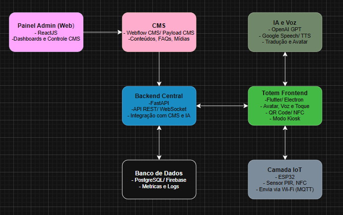

# 🧠 Challenge FlexMedia – Totem Inteligente com IA

**Grupo:** Leno | **Turma:** 1TIAOR | **Sprint:** 1  
**Data:** 31/10/2025

---

## 📘 1. Introdução
Concierge IA é um projeto de totem inteligente com assistente virtual, voltado para instituições e espaços públicos.
O sistema combina interação por voz, toque e avatar digital, integração com sensores IoT, IA para respostas contextuais e um CMS para gerenciamento dinâmico de conteúdo, oferecendo informações aos visitantes de forma interativa e segura.

---

## 🎯 2. Problema e Solução Proposta
O projeto visa o desenvolvimento de um sistema inteligente de atendimento em totens digitais. Ele atua como um assistente virtual físico, capaz de recepcionar, orientar visitantes e fornecer informações de forma interativa, acessível e personalizável. 

A solução busca integrar IA, voz e interface multimodal (voz, toque e avatar) para oferecer uma experiência intuitiva, com gestão centralizada de conteúdo via CMS e compatibilidade com diversos sistemas operacionais (Android, Windows, Linux e Web).

Pensado para atender visitantes de espaços educativos, como museus e zoologicos, fornecendo novas experiencias a esses ambientes, aumentando a imersão ao ambiente. 

---

## 🧩 3. Arquitetura Técnica Inicial

📁 **Arquivo do diagrama:** `./docs/arquitetura.png`

---

##  4. Tecnologias e Ferramentas
#### 4.1 🎯 Camada IoT
* Dispositivos: ESP32 / ESP32-CAM
Sensores: PIR (presença), NFC, câmera, microfone

* Funções: Detecta presença e ativa o totem

* Envia eventos e métricas via Wi-Fi (MQTT)

* Suporte para interação por aproximação (NFC/QR Code)

#### 4.2 🖥️ Totem Frontend
* Tecnologias: Flutter Web / Electron

* Funções: Interface multimodal (toque, voz e avatar)

* Exibição de respostas com áudio e legenda

* Integração com ESP32 para enviar informações ao usuário via QR Code ou NFC.

* Suporte a modo kiosk (uso em totens públicos)

* Recebe conteúdo dinâmico via CMS e dados processados pelo backend

#### 4.3 ⚙️ Backend Central
* Tecnologias: FastAPI (Python) ou Node.js (JavaScript)

* Funções: API REST / WebSocket para comunicação entre totens e nuvem

* Gerencia autenticação (JWT) e controle de sessões

* Integra com CMS, camada de IA e banco de dados

* Armazena logs, interações e métricas de uso

#### 4.4 🧠 Camada de IA e Voz
* Tecnologias: OpenAI GPT / Google Speech / TTS

* Funções: Gera respostas conversacionais contextuais

* Converte fala ↔ texto e texto ↔ fala

* Suporte a tradução automática.

* Personalização futura com perfis de assistente

#### 4.5 ☁️ Banco de Dados
* Tecnologias: PostgreSQL / Firebase 

* Funções: Armazenamento persistente de interações e usuários

* Registro de métricas de uso e desempenho

* Base de logs para análise de engajamento e comportamento

#### 4.6 🗂️ CMS (Gerenciador de Conteúdo)
* Tecnologias: Webflow CMS ou Payload CMS

* Funções: Armazena textos, FAQs, imagens, links e conteúdos dinâmicos

* Permite atualização rápida de informações sem intervenção técnica

* Integra-se via API REST com o Backend Central

* Atualizações refletidas automaticamente nos totens ativos

#### 4.7 📊 Painel Administrativo (Web)
* Tecnologias: ReactJS

* Funções: Interface de controle e monitoramento centralizado

* Visualização de métricas e logs de uso

* Configuração de múltiplos totens

* Acesso e edição de conteúdo do CMS

* Controle de permissões e segurança

---

## 📊 5. Estratégia de Coleta e Análise de Dados
A coleta e análise de dados do Totem AI Assistant têm como objetivo monitorar o uso, otimizar a experiência do usuário e fornecer relatórios para tomada de decisão.
O pipeline de dados foi projetado para ser modular, seguro e escalável, integrando sensores físicos, backend em nuvem e dashboards administrativos.

#### 5.1 Fontes de Dados (Sensores e Interações)

* Sensores e suas finalidades:

* Sensor PIR → Detecta presença e ativa o sistema, registrando o tempo de uso.

* Microfone + API Speech-to-Text → Captura voz do usuário e converte fala em texto para análise.

* ESP32-CAM (opcional) → Realiza reconhecimento facial básico ou contagem de interações.

* Tela sensível ao toque (Frontend Flutter/Electron) → Registra eventos de navegação e seleção.

* Leitor NFC / Módulo QR Code → Permite salvar informações (PDF, links) por aproximação ou escaneamento.

* Interface de avaliação do usuário → Coleta feedback e notas de satisfação.

#### 5.2 Coleta e Transmissão

* Dados capturados pelos sensores e pela interface são enviados ao Backend Central via HTTP ou MQTT.

* Cada evento contém:

* `totem_id`

* `timestamp`

* `tipo_evento`

* `payload` (dados específicos da interação)

* Toda a comunicação é criptografada com HTTPS/TLS e autenticada com token JWT.

#### 5.3 Armazenamento e Estrutura de Dados

Os dados coletados são organizados em três categorias principais:

* Eventos e métricas: armazenados em InfluxDB ou PostgreSQL, contendo logs e dados em tempo real.

* Conteúdo e respostas: mantidos no CMS (Payload CMS ou Webflow CMS), com textos, mídias e FAQs.

* Usuários e configurações: salvos em PostgreSQL ou Firebase, incluindo preferências e idioma.

***Dados sensíveis são anonimizados conforme as diretrizes da LGPD.***

#### 5.4 Tratamento e Processamento

* O backend agrega os dados por totem, local e período;

* Eventos duplicados ou incompletos são filtrados;

* Métricas principais calculadas:

* Tempo médio de interação;

* Engajamento por idioma;

* Avaliação média de satisfação;

* Quantidade de downloads por QR/NFC;

* Volume de voz e palavras por sessão;

* Ranking de perguntas mais comuns.

---

## 🧱 6. Plano Inicial de Desenvolvimento

- Pablo Leon Dimauro Gonzalez | RM567944 | Responsável pelo desenvolvimento geral do projeto

---

## 🔐 7. Segurança e Privacidade
* Autenticação JWT entre frontend e backend;

* Conexões HTTPS e comunicação cifrada com APIs;

* Armazenamento de dados conforme LGPD;

* Logs anonimizados para análise estatística.
---

## 📚 8. Referências
* FastAPI — Documentação oficial: https://fastapi.tiangolo.com/
* Flutter (Web) — Documentação oficial: https://flutter.dev/multi-platform/web
* OpenAI API — Documentação oficial: https://platform.openai.com/docs/api-reference
* Azure OpenAI REST API Reference: https://learn.microsoft.com/en-us/azure/ai-foundry/openai/reference
* Payload CMS — documentação “What is Payload?”: https://payloadcms.com/docs/getting-started/what-is-payload

---

## 👥 9. Integrantes (Nome + RM)
- Pablo Leon Dimauro Gonzalez | RM567944

---

## 📎 10. Link do Repositório
https://github.com/pl-gonzalez/challenge_flexmedia

---
💡 *Esta documentação refere-se à Sprint 1 (Proposta Técnica Inicial).*
